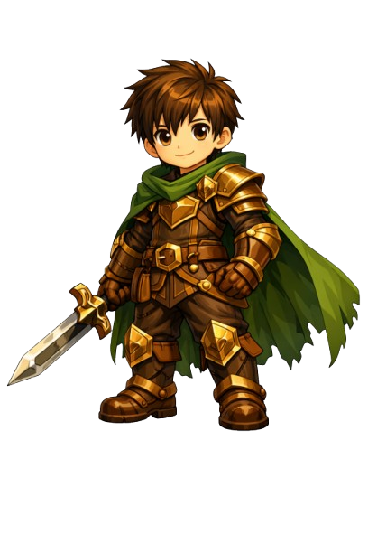

# 세계 지식 창고를 지켜라! 🐉

## 폴더 구조
```
dragon-game/
├── index.html       ← 메인 파일 (브라우저로 열기)
├── css/
│   └── style.css    ← 디자인
├── js/
│   └── game.js      ← 게임 로직
└── images/          ← 이미지 넣는 곳 (나중에)
```

## 실행 방법
index.html 파일을 브라우저로 열면 바로 실행됩니다.

---

## 이미지 교체 방법

### 1. 배경 이미지 교체 (css/style.css)
```css
/* 현재 */
.battle-bg.bg1 { background: linear-gradient(...); }

/* 이미지로 교체할 때 */
.battle-bg.bg1 {
  background-image: url('../images/dungeon1_bg.png');
  background-size: cover;
}
```

### 2. 캐릭터 이미지 교체 (index.html)
```html
<!-- 현재 -->
<div class="sprite-emoji" id="hero-spr">🧙</div>

<!-- 이미지로 교체할 때 -->

```

### 3. 동작별 이미지 교체 (js/game.js)
```javascript
// setAnim 함수 안에 주석 처리된 부분 활성화
function setAnim(id, animName) {
  const el = document.getElementById(id);
  el.className = 'sprite-emoji ' + animName;

  // 이미지 교체
  if (id === 'hero-spr') {
    if (animName === 'idle')   el.src = 'images/hero_idle.png';
    if (animName === 'attack') el.src = 'images/hero_attack.png';
    if (animName === 'hit')    el.src = 'images/hero_hit.png';
  }
  if (id === 'enemy-spr') {
    if (animName === 'idle')   el.src = 'images/enemy_idle.png';
    if (animName === 'attack') el.src = 'images/enemy_attack.png';
    if (animName === 'hit')    el.src = 'images/enemy_hit.png';
  }
}
```

## 필요한 이미지 목록 (코파일럿으로 만들 것)
- hero_idle.png    ← 용사 대기
- hero_attack.png  ← 용사 공격
- hero_hit.png     ← 용사 피격
- enemy1_idle.png  ← 헤츨링 대기
- enemy1_attack.png← 헤츨링 공격
- enemy2_idle.png  ← 용 대기
- enemy3_idle.png  ← 나이많은 용 대기
- dungeon1_bg.png  ← 헤츨링 던전 배경
- dungeon2_bg.png  ← 용 던전 배경
- dungeon3_bg.png  ← 나이많은 용 배경
